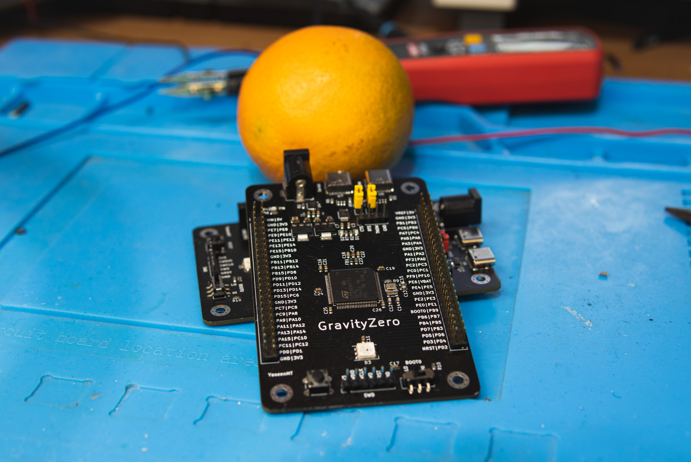
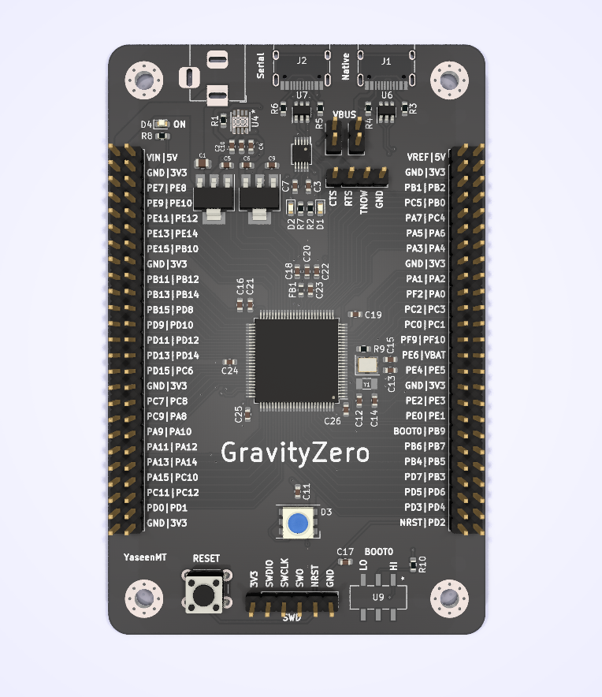

# GravityZero

GravityZero is an Open Source STM32G473-based development board with two USB ports (Native & CH340 Serial), and access to nearly all the IO ports through the headers. alongside an onboard "NeoPixel" RGB LED.

More can be learned about it in my [Write Up Here](https://yaseen.ly/stm32g473-development-board-gravityzero/).

### Should you build one ?
Most probably not no, the microcontroller isn't cheap ( at the time of writing ), the pcb is 4 layer pcb which can most likely be reduced down to two, and there plenety of cheaper options out there.
This was designed for the experience & fun, which again you can learn more about in my write up.

---
### License 
 This work is licensed under a <a rel="license" href="http://creativecommons.org/licenses/by-sa/4.0/">Creative Commons Attribution-ShareAlike 4.0 International License</a>.
